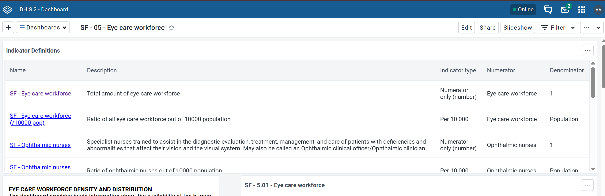

# DHIS2 indicator definitions dashboard plugin

A simple table to pull descriptions of all indicators used in all the dashboard's visualizations or maps.

**Only indicators**, not data elements or program indicators that may be used on a dashboard.

Tested against v2.42.4